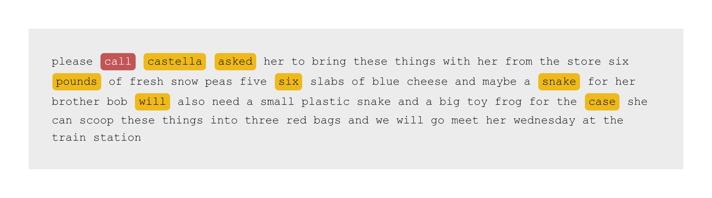

<!-- README.md is generated from README.Rmd. Please edit that file -->

```{r, include = FALSE}
knitr::opts_chunk$set(
  collapse = TRUE,
  comment = "#>",
  fig.path = "man/figures/README-",
  out.width = "100%"
)
```

# LingWER

<!-- badges: start -->
<!-- badges: end -->

The goal of LingWER is to ...

## Installation

You can install the development version of LingWER from [GitHub](https://github.com/) with:

``` r
# install.packages("remotes")
remotes::install_github("yjunechoe/LingWER")
```

## Example

```{r example}
library(LingWER)

stella_sentence_truth <- "
  Please call Stella. Ask her to bring these things with her from the store:
  Six spoons of fresh snow peas, five thick slabs of blue cheese, and maybe
  a snack for her brother Bob. We also need a small plastic snake and a big
  toy frog for the kids. She can scoop these things into three red bags,
  and we will go meet her Wednesday at the train station.
"

stella_sentence_observed <- "
  Please castella asked her to bring these things with her from the store.
  Six pounds of fresh snow peas, five six slabs of blue cheese and maybe
  a snake for her brother Bob will also need a small plastic snake and a big
  toy frog for the case. She can scoop these things into three red bags
  and we will go meet her Wednesday at the train station.
"

stella_matrix <- match_matrix(stella_sentence_observed, stella_sentence_truth, unit = "letter")

# Truth x Observed
dim(stella_matrix)
rownames(stella_matrix)
colnames(stella_matrix)
```

Get the word error rate (and other info) with `get_metrics()`

```{r get-metrics}
get_metrics(stella_matrix)
```

Visualize with `draw_WER()`

```{r, eval = FALSE}
draw_WER(stella_matrix)
```



Another example:

```{r, eval = FALSE}
stella_sentence_observed2 <- "On the Police Coast our ask her to bring this thing things with her from the store six spoons of fresh snow peas five slabs of blue cheese and maybe a snack for her brother Bob also need a small plastic snake and a big toy frog for the kids. She can scoop these things in the three bread bags and we will go meet her Wednesday at the train station."

stella_matrix2 <- match_matrix(stella_sentence_observed2, stella_sentence_truth, unit = "none")

draw_WER(stella_matrix2)
```


