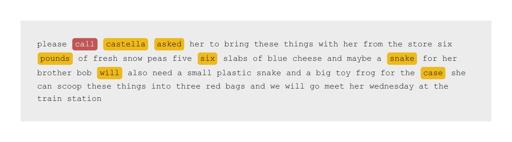
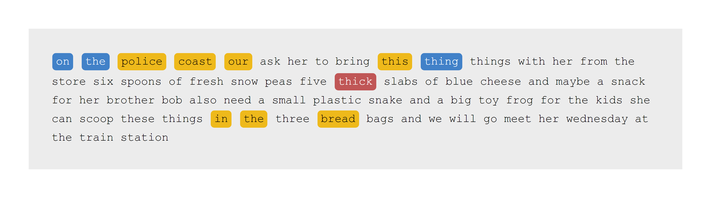
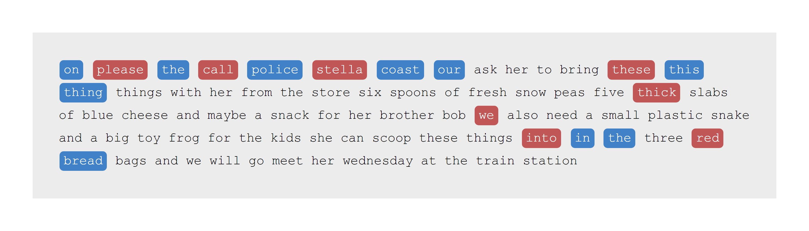

<!-- README.md is generated from README.Rmd. Please edit that file -->

# LingWER

<!-- badges: start -->
<!-- badges: end -->

The goal of LingWER is to …

## Installation

You can install the development version of LingWER from
[GitHub](https://github.com/) with:

``` r
# install.packages("remotes")
remotes::install_github("yjunechoe/LingWER")
```

## Example

``` r
library(LingWER)

stella_sentence_truth <- "
  Please call Stella. Ask her to bring these things with her from the store:
  Six spoons of fresh snow peas, five thick slabs of blue cheese, and maybe
  a snack for her brother Bob. We also need a small plastic snake and a big
  toy frog for the kids. She can scoop these things into three red bags,
  and we will go meet her Wednesday at the train station.
"

stella_sentence_observed <- "
  Please castella asked her to bring these things with her from the store.
  Six pounds of fresh snow peas, five six slabs of blue cheese and maybe
  a snake for her brother Bob will also need a small plastic snake and a big
  toy frog for the case. She can scoop these things into three red bags
  and we will go meet her Wednesday at the train station.
"

stella_matrix <- match_matrix(stella_sentence_observed, stella_sentence_truth, unit = "letter")

# Truth x Observed
dim(stella_matrix)
#> [1] 69 68
rownames(stella_matrix)
#>  [1] "please"    "call"      "stella"    "ask"       "her"       "to"       
#>  [7] "bring"     "these"     "things"    "with"      "her"       "from"     
#> [13] "the"       "store"     "six"       "spoons"    "of"        "fresh"    
#> [19] "snow"      "peas"      "five"      "thick"     "slabs"     "of"       
#> [25] "blue"      "cheese"    "and"       "maybe"     "a"         "snack"    
#> [31] "for"       "her"       "brother"   "bob"       "we"        "also"     
#> [37] "need"      "a"         "small"     "plastic"   "snake"     "and"      
#> [43] "a"         "big"       "toy"       "frog"      "for"       "the"      
#> [49] "kids"      "she"       "can"       "scoop"     "these"     "things"   
#> [55] "into"      "three"     "red"       "bags"      "and"       "we"       
#> [61] "will"      "go"        "meet"      "her"       "wednesday" "at"       
#> [67] "the"       "train"     "station"
colnames(stella_matrix)
#>  [1] "please"    "castella"  "asked"     "her"       "to"        "bring"    
#>  [7] "these"     "things"    "with"      "her"       "from"      "the"      
#> [13] "store"     "six"       "pounds"    "of"        "fresh"     "snow"     
#> [19] "peas"      "five"      "six"       "slabs"     "of"        "blue"     
#> [25] "cheese"    "and"       "maybe"     "a"         "snake"     "for"      
#> [31] "her"       "brother"   "bob"       "will"      "also"      "need"     
#> [37] "a"         "small"     "plastic"   "snake"     "and"       "a"        
#> [43] "big"       "toy"       "frog"      "for"       "the"       "case"     
#> [49] "she"       "can"       "scoop"     "these"     "things"    "into"     
#> [55] "three"     "red"       "bags"      "and"       "we"        "will"     
#> [61] "go"        "meet"      "her"       "wednesday" "at"        "the"      
#> [67] "train"     "station"
```

Get the word error rate (and other info) with `get_metrics()`

``` r
get_metrics(stella_matrix)
#> $WER
#> [1] 0.115942
#> 
#> $info
#> $info$substitutions
#> castella    asked   pounds      six    snake     will     case 
#> "stella"    "ask" "spoons"  "thick"  "snack"     "we"   "kids" 
#> 
#> $info$edit_distance
#> [1] 2 2 3 4 2 3 4
#> 
#> $info$deletions
#> [1] "call"
#> 
#> $info$insertions
#> character(0)
```

Visualize with `draw_WER()`

``` r
draw_WER(stella_matrix)
```



Another example with letter-edits (“letter”) and no edits (“none”):

``` r
stella_sentence_observed2 <- "On the Police Coast our ask her to bring this thing things with her from the store six spoons of fresh snow peas five slabs of blue cheese and maybe a snack for her brother Bob also need a small plastic snake and a big toy frog for the kids. She can scoop these things in the three bread bags and we will go meet her Wednesday at the train station."
```

``` r
stella_matrix2_letter <- match_matrix(stella_sentence_observed2, stella_sentence_truth, unit = "letter")
draw_WER(stella_matrix2_letter)
```



``` r
stella_matrix2_none <- match_matrix(stella_sentence_observed2, stella_sentence_truth, unit = "none")
draw_WER(stella_matrix2_none)
```


